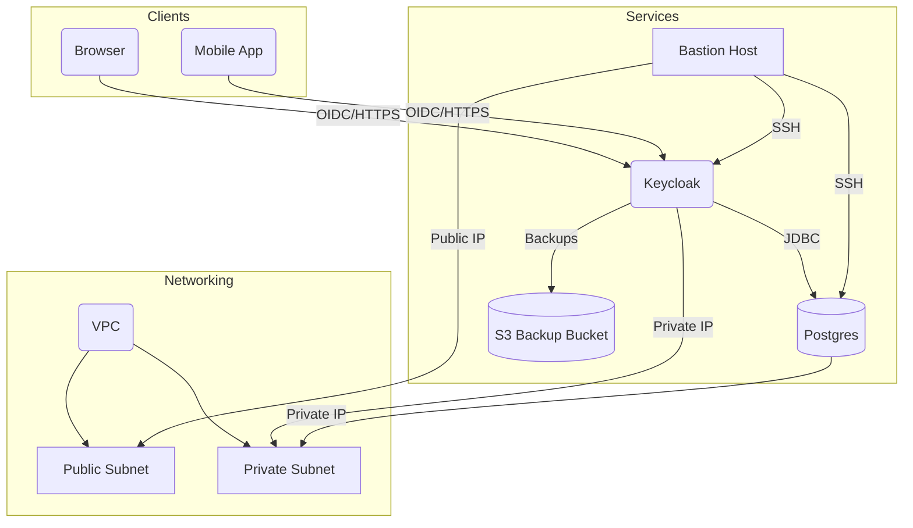

# System Architecture

This diagram outlines the initial infrastructure for the authentication service. Traffic from clients reaches Keycloak through public endpoints, while the database and backups remain within private subnets. A bastion host manages SSH access. CloudTrail is enabled to audit API calls.
